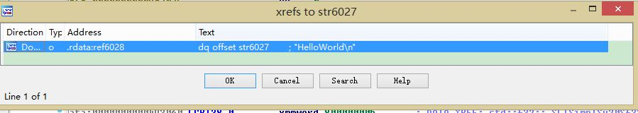
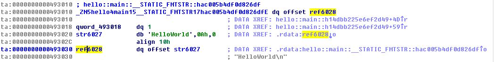
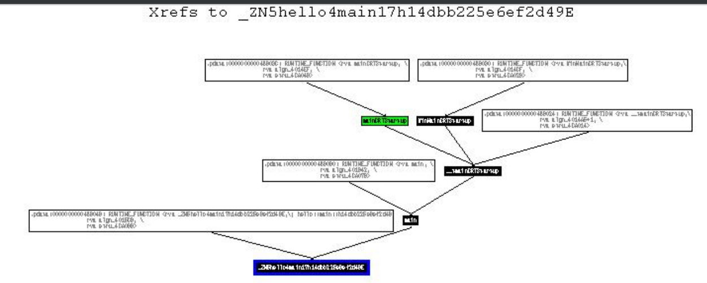

# Into the Binary of Rust HelloWord

## The Source Code

```rust
fn main(){
	println!("HelloWorld");
}
```

## Into the Binary

1. Locating the Entry Point by `rabin2 -Ie hello.exe`, the result show that the entrypoint is 0x4014d0.

2. Locating the "HelloWorld" String, the addr is 0x493020.

3. Backtrace the xref, and found there is only one reference to the addr, . The addr of the addr is never directly passed to instructions.

4. The xref to the str is stored as a static value in the data section in addr ox493030, and this addr is referred only by 0x493010, which is also a static value in data section.


5. 0x493010 is refered in the function of _ZN5hello4main17h14dbb225e6ef2d49E. This should be the main function, and code related to the str are described as follows. In the line 5, 18, there are to derefering operation, and finally pointing to the str. .

6. The call graph to the node _ZN5hello4main17h14dbb225e6ef2d49E is as follows: . Node _ZN5hello4main17h14dbb225e6ef2d49E was referred by the main function, and it is passed as an augment to the **lang_start** function. . This corresponed to our previous analysis.

## Conclusion.

* Instruction doesn't have raw access to the data?
*
